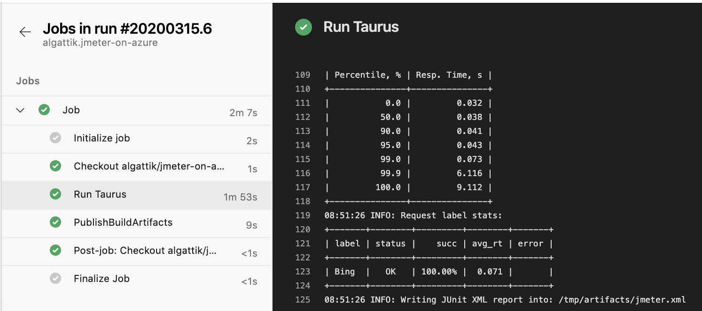
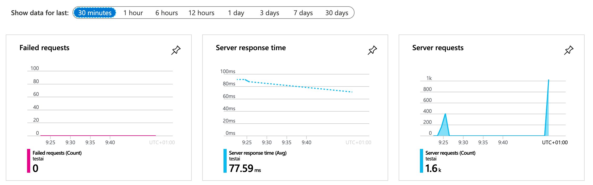

# JMeter on Azure samples

JMeter is a highly versatile integration testing tool. It is often used as a load testing tool for web applications, but can also be used for functional testing and for testing other types of services, such as databases.

These samples propose simple starter solutions that can be easily deployed and integrated into DevOps projects.

## Background

JMeter is a very mature and full-featured tool. It is cross-platform and extensible, and allows defining complex test plans without writing code.

However, JMeter can be challenging to use in DevOps environments:
* Much useful JMeter functionality is provided through plug-ins, for which automated installation is cumbersome.
* JMeter plans are stored in XML files that tend to mix many aspects of the test plan, such as connectivity, logic, assertions, and client ramp-up behavior. Such complex plans can be hard to manage and peer review.
* JMeter integrates basic reporting functionality, but in automated runs, those are only available after tests have finished. Real-time monitoring requires installing additional components such as InfluxDB and Grafana.

Fully fledged test environments require spinning multiple Azure components with considerable scripting, such as the [Scalable Apache JMeter Test Framework using Azure Kubernetes Service and Grafana](https://techcommunity.microsoft.com/t5/azurecat/scalable-apache-jmeter-test-framework-using-azure-kubernetes/ba-p/1197379#).

In these starter samples we propose simple starter solutions that can be easily integrated and deployed in automated CI/CD builds. The samples run in Docker and can therefore be executed on CI build agents or in Kubernetes.

## [Taurus 101](taurus-101)

[Taurus](https://gettaurus.org/docs/Index/) is an open-source wrapper around JMeter. It can run in a Docker container, and allows automating the installation of the proper JMeter version and necessary plug-ins. Taurus can take an existing JMeter plan and define load profile and assertions through simple configuration:
```
execution:
- scenario: website-test
  concurrency: 10
  hold-for: 120s
  ramp-up: 10s
```



The sample demonstrates integrating JMeter with Azure Application Insights to get real-time visibility into scenario execution.



## [Taurus 201: Event Hubs Kafka](taurus-201-event-hubs-kafka)

In the next sample we demonstrate connecting to Kafka (in this case, Azure Event Hubs exposing the Kafka protocol) through custom code.
