# Taurus 101

[Taurus](https://gettaurus.org/docs/Index/) is an open-source wrapper around JMeter. It can run in a Docker container, and allows automating the installation of the proper JMeter version and necessary plug-ins.

This sample demonstrates a simple JMeter job that checks that a successful request can be made to `http://bing.com`. A Taurus job runs the job concurrently in an ephemeral Docker container which can be run as part of a CI/CD build.

## Quick run

To run the sample locally, make sure you have Docker installed, and run:
```
./run-test-on-docker.sh
```

This will produce an HTML report under `artifacts/report/index.html`:

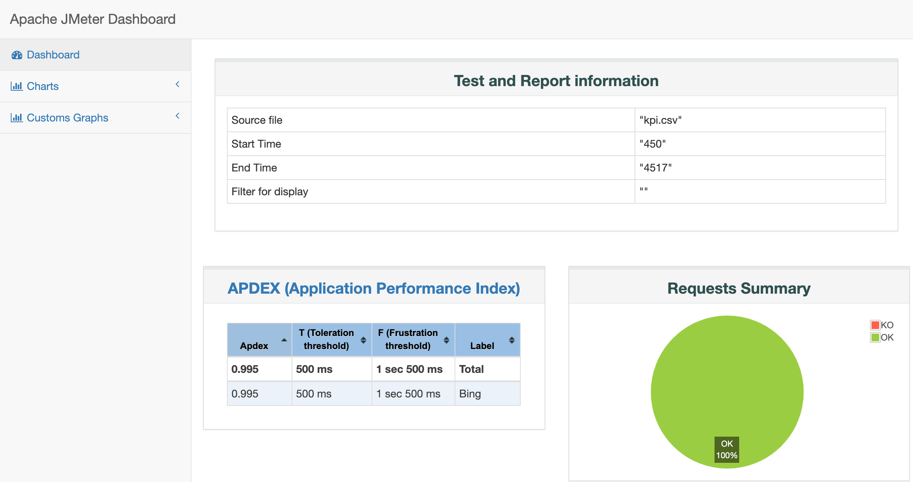

## Adding Application Insights live reporting

[Create an Azure Application Insights resource](https://docs.microsoft.com/en-us/azure/azure-monitor/app/create-new-resource) and copy the Instrumentation Key.
Run the commands below, replacing the key value with yours:

```
export INSTRUMENTATION_KEY=00000000-0000-0000-0000-000000000000
./run-test-on-docker.sh
```

You can follow the run outcomes in the Application Insights resource in the Azure portal:


You can see test data in real time in the Live Metrics view. Note that the view is available only while the test is running, so you may need to increase the test duration
in
[scripts/website-test.yml](scripts/website-test.yml) to see this view.

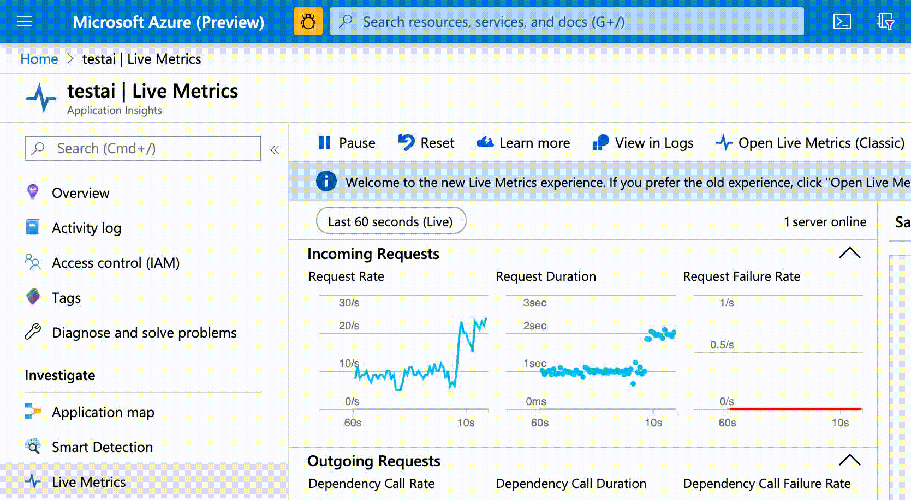

You can also dig into the logs (`requests` collection) and generate charts and dashboards:

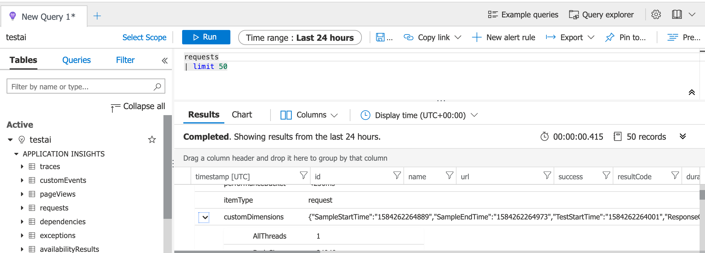

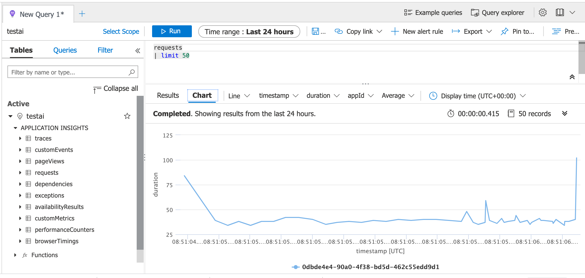


## Running in Azure Pipelines

In Azure DevOps, create a Variable Group named `jmeter-on-azure`.
In the variable group, set the INSTRUMENTATION_KEY variable to get live results in Application Insights.

Import the file [azure-pipelines.yml](azure-pipelines.yml) into Azure DevOps Pipelines.

The pipeline run shows detailed output, integrates test results, and generates an HTML report as an attached artifact.


The JMeter test is integrated into the Tests view of the pipeline.

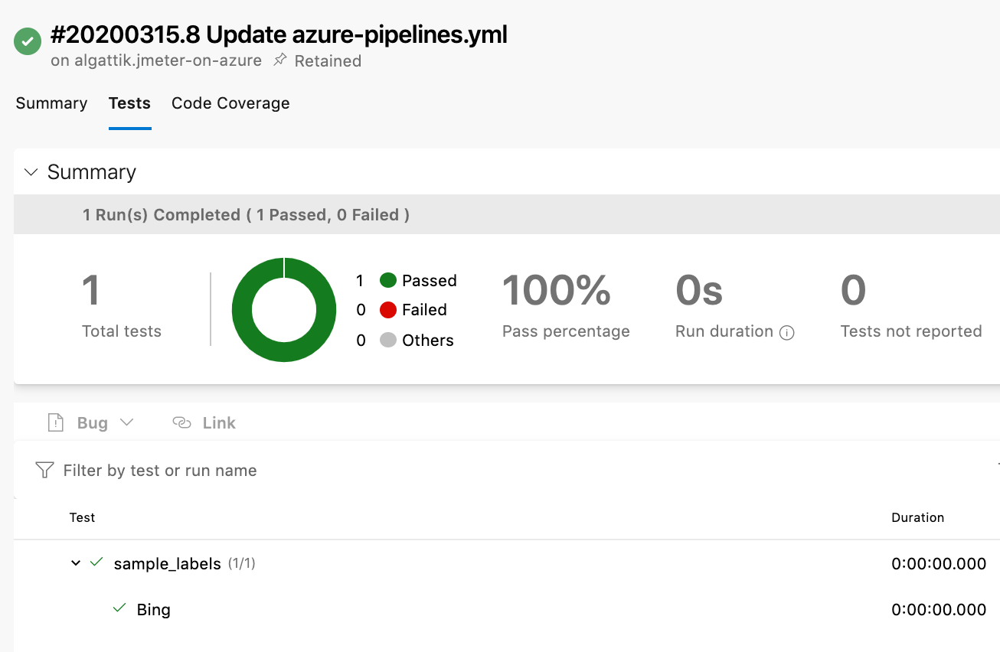

The report can be downloaded as a ZIP file from the Artifacts section.

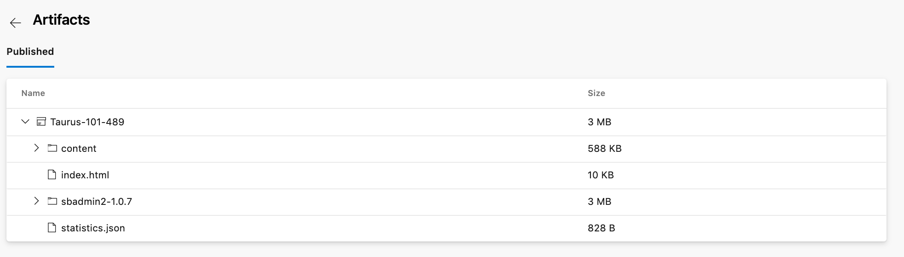

## Walkthrough

### JMeter plan

Install JMeter locally and open the test plan [scripts/website-test.jmx](scripts/website-test.jmx).

The Test Plan defines variables, that can be set via properties (`__P` syntax).
* When running JMeter interactively, you can set those values in the JMeter `user.properties` file (you need to restart JMeter after changing that file).
* In an automated run, those values are set on the command line.

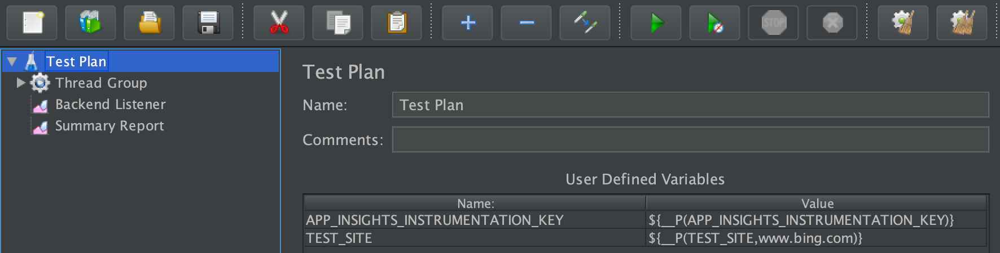

In the Thread Group, we define the agent threads running parallel tests. Here we have only one thread, configured to run 10 times.

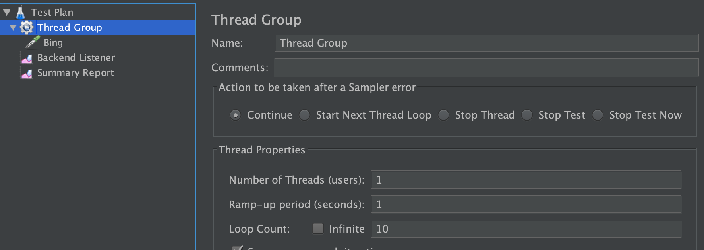

In the HTTP Request configuration, we define the request to be sent. Here we simply send a GET request to `${TEST_SITE}/`, i.e. by default to `http://bing.com/`.

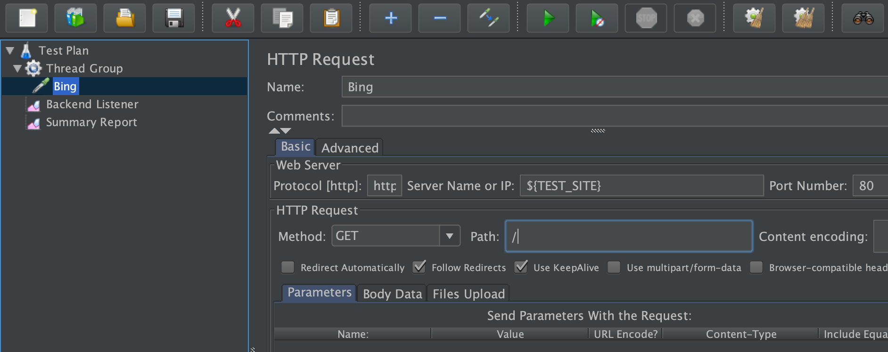

In the Backend Listener configuration, we (optionally) connect to Application Insights to send live logs and metrics.

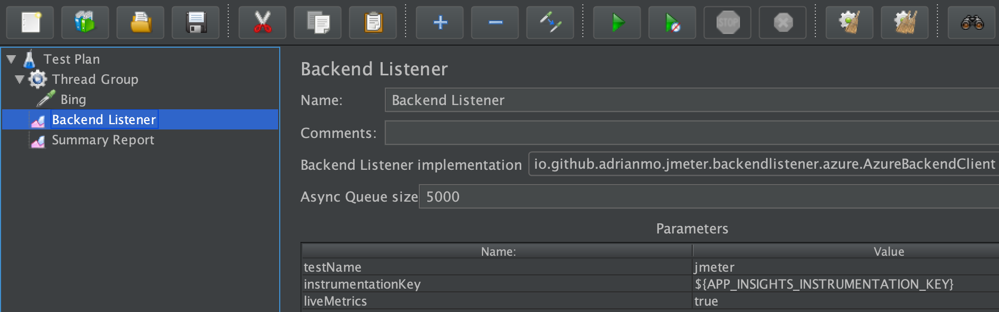

The Summary Report view is populated when the test is run interactively. Click the start button to run the test:

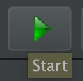

The Summary Report view displays summary statistics.

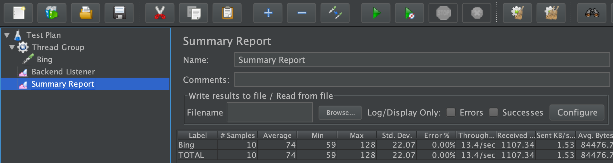

### Taurus script

The Taurus configuration script at [scripts/website-test.yml](scripts/website-test.yml) contains the following sections.

The `modules` section is configured to install JMeter 5.2.1. Taurus also automatically installs commonly used plugins. In addition, we install the [jmeter-backend-azure](https://github.com/adrianmo/jmeter-backend-azure) plugin in order to send live data to Application Insights.

```
modules:
  jmeter:
    path: /jmeter
    version: 5.2.1
    download-link: https://archive.apache.org/dist/jmeter/binaries/apache-jmeter-{version}.zip
    plugins:
    - jmeter.backendlistener.azure
```

The `execution` section configures scenario execution plans. Here we configure concurrent execution of 5 clients for 10 iterations for 10 seconds.

At execution, Taurus overwrites the values in the JMeter Test plan (Thread Group) with the values defined here.

```
execution:
- scenario:
    script: website-test.jmx
  concurrency: 5
  iterations: 10
  hold-for: 10s
  ramp-up: 2s
```

Under `services`, we configure a post-processing step in order to generate an HTML report.

```
services:
- module: shellexec
  post-process:
  - >
    cd ${TAURUS_ARTIFACTS_DIR}
    && rm -rf report
    && cp kpi.jtl kpi.csv
    && /jmeter/bin/jmeter -Jjmeter.save.saveservice.assertion_results_failure_message=false -g kpi.csv -o report -q jmeter-bzt.properties
```

In the `reporting` section, we configure a JUnit XML report. That report can be imported and consumed by Azure Pipelines.

```
reporting:
- module: junit-xml
  filename: /tmp/artifacts/TEST-jmeter.xml
```
