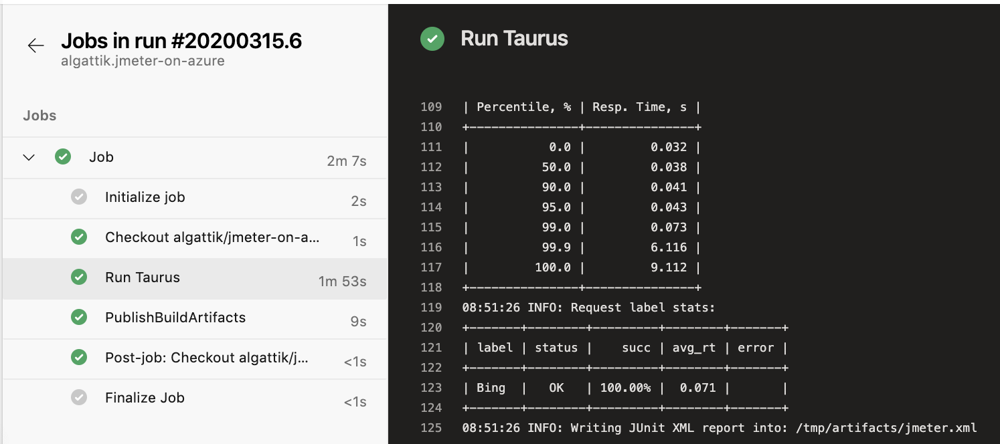

# Taurus 201: Event Hubs Kafka

Check out sample [Taurus 101](../taurus-101) for an introduction to these samples using Taurus.

This sample demonstrates a JMeter job that contains Groovy code to send messages to Kafka. Groovy is a lightweight script engine that compiles dynamically to Java bytecode and offers excellent performance.

## Quick run

To run the sample locally, first deploy two Azure resources:
* Optionally, [create an Azure Application Insights resource](https://docs.microsoft.com/en-us/azure/azure-monitor/app/create-new-resource) and copy the Instrumentation Key.
* [Create an Azure Event Hubs namespace](https://docs.microsoft.com/en-us/azure/event-hubs/event-hubs-create) in Standard or Premium tier. Create an Event Hub within the namespace, and create an access policy on the Event Hub with `Send` permission. Copy the connection string.

Make sure you have Docker and Apache Maven installed, and run:
```
# Make sure the connection string contains EntityPath
export EVENT_HUBS_CONNECTION_STRING="Endpoint=sb://MYNAMESPACE.servicebus.windows.net/;SharedAccessKeyName=MYPOLICY;SharedAccessKey=MYKEY;EntityPath=MYEVENTHUB"
export INSTRUMENTATION_KEY=00000000-0000-0000-0000-000000000000
./run-test-on-docker.sh
```

This will produce an HTML report under `artifacts/report/index.html`:


## Running in Azure Pipelines

In Azure DevOps, create a Variable Group named `jmeter-on-azure`.
In the variable group, set the EVENT_HUBS_CONNECTION_STRING variable to your Event Hubs connection string.
Optionally, set the INSTRUMENTATION_KEY variable to get live results in Application Insights.

Import the file [azure-pipelines.yml](azure-pipelines.yml) into Azure DevOps Pipelines.

The pipeline run shows detailed output, integrates test results, and generates an HTML report as an attached artifact.



## Walkthrough

### Building the Kafka Client JAR

The sample contains a Maven POM file [kafka-clients-uber-jar.xml](kafka-clients-uber-jar.xml) that can be used to build a "uber-JAR" containing the Kafka Clients library and all its dependencies.

To build this library, run
```
mvn package -f kafka-clients-uber-jar.xml
```

The library is created under `target/kafka-clients-uber-jar-0.0.1.jar`.

Copy this file into your JMeter `lib/ext/` directory.

### JMeter plan

Install JMeter locally and open the test plan [scripts/kafka-test.jmx](scripts/kafka-test.jmx).

The Test Plan defines variables, that can be set via properties (`__P` syntax).
* When running JMeter interactively, you can set those values in the JMeter `user.properties` file (you need to restart JMeter after changing that file).
* In an automated run, those values are set on the command line.

Three thread groups contain code to set up a KafkaProducer, use it to generate Kafka messages, and close the KafkaProducer respectively.


You can run the producer after having updated the connection string in `user.properties`:


### Taurus script

The Taurus configuration script at [scripts/kafka-test.yml](scripts/kafka-test.yml) contains the following sections.

The `execution` section configures scenario execution plans. Here we reference the Kafka Clients JAR file we have built. We also configure concurrent execution of 5 clients for 2000 iterations.

At execution, Taurus overwrites the values in the JMeter Test plan (Thread Group) with the values defined here.

```
execution:
- scenario:
    script: kafka-test.jmx
    properties:
      user.classpath: /user-jars/kafka-clients-uber-jar-0.0.1.jar
  concurrency: 5
  iterations: 2000
```
